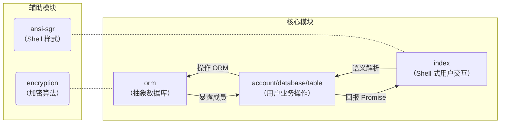

# 欢迎使用 PenyoDB

PenyoDB 是一款基于 TypeScript 的 NoSQL 数据库，兼容部分 SQL 语法。

## 开始

PenyoDB 必须运行在 Node.js（*或 Deno*[^isDenoAvailable?]）上。

在项目目录下打开终端，输入：

```text
npm i
npm run dev
```

[^isDenoAvailable?]: 理论上项目也可以在 Deno 上运行，但未经测试。

## 模块设计


