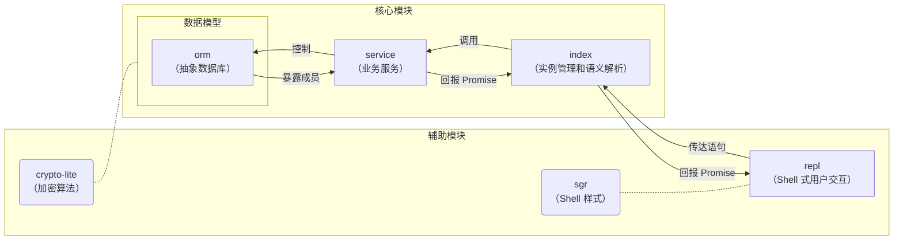

# 欢迎使用 PenyoDB

PenyoDB 是一款基于 TypeScript 的 NoSQL 数据库，使用 SQL-like 语法。

## 开始

### 以交互式解释器（REPL）

PenyoDB REPL 必须运行在 Node.js（*或 Deno*[^isDenoAvailable]）上。Node.js 的[版本](https://nodejs.org/dist/)必须大于 16。

在项目目录下打开终端，输入：

```text
npm i
npm run dev
```

当看到“欢迎”时，则表示您可以开始使用了。您可以输入 [SQL-like](#sql-like-语法) 语句来执行操作。

[^isDenoAvailable]: 理论上项目也可以在 Deno 上运行，但未经测试。

### 以浏览器插件（Script）

> 该功能正处于开发阶段，现阶段效果不代表最终品质。

PenyoDB Script 为前端提供了读取数据库的能力。

在项目目录下打开终端，输入：

```text
npm i
npm run build
```

此操作将在 `./dist` 中生成 `penyo-db.js` 和 `penyo-db.min.js`，您可以以 `<script>` 的形式将其一引入 HTML 页面。通过调用 `Promise grammarAnalyze()` 函数来传达语句、执行操作。

下面展示了一个查询指定数据的过程：

```js
import * as PDB from './penyo-db.min' // 您应该在生产环境中使用“min”库

[ // 断言下列语句能成功线性执行
    "login root with token 1234", // 登录
    "use student_info", // 配置工作区
    "select * from major301 where age < 18, sex = female" // 条件查询
].forEach(async comm => {
    const result = await PDB.grammarAnalyze(comm)
    if (result instanceof PDB.View) // 如若得到视图实例，就......
        console.log(result)
})
```

## 模块设计概要



||REPL 式|Script 式|
|:-:|-|-|
|**交互代理**|`repl` 模块|向外暴露的 `grammarAnalyze()`|
|**并发控制**|支持[^isConcurrentAvailable]|不支持|
|**数据加密/校验**|支持|不支持|

[^isConcurrentAvailable]: 需要等待远程控制系统完成。

## SQL-like 语法

为了简化控制，PenyoDB 支持 SQL-like 语法，这与标准 SQL 略有不同。如语句不需要结束符、字符串值不需要引号对标注、函数引用不需要括号对标注，等。

与 SQL 的其它实现略有出入的关键字如下：

|关键字|解析|
|-|-|
|`login`|登录。未登录状态下，所有业务服务均无法被调用。<br>> login root with token 1234||
|`grant`|授权。用户数据读写权限被设定为只有三档：`Permission.INACCESSIBLE`、`Permission.READONLY` 和 `Permission.DOMINATE`；业务服务权限是硬编码的，无法被修改。<br>> grant dominate on demodb.demotb to user101||
|`insert`|插入。不支持多行插入。<br>> insert into demotb(name, sex) values(leo, male)|
