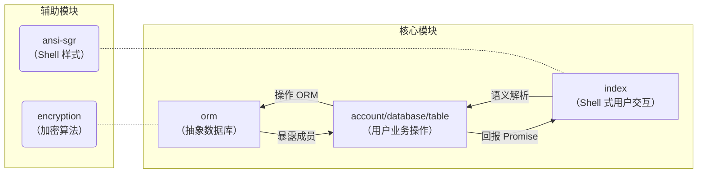

# 欢迎使用 PenyoDB

PenyoDB 是一款基于 TypeScript 的 NoSQL 数据库，使用 SQL-like 语法。

## 开始

### 以交互式解释器（REPL）

PenyoDB REPL 必须运行在 Node.js（*或 Deno*[^isDenoAvailable?]）上。

在项目目录下打开终端，输入：

```text
npm i
npm run dev
```

当看到“欢迎”时，则表示您可以开始使用了。您可以输入 SQL-like 语句来执行操作。

[^isDenoAvailable?]: 理论上项目也可以在 Deno 上运行，但未经测试。

### 以浏览器插件（Script）

> 该功能正处于开发阶段，且不能保证最终上线时仍会保留。

PenyoDB Script 为前端提供了直接操作数据库的能力。

在项目目录下打开终端，输入：

```text
npm i
npm run build
```

此操作将在项目根目录生成 `penyo-db.min.js`，您可以以 `<script>` 的形式将其引入 HTML 页面。通过调用 `Promise runPDB()` 函数来传达语句、执行操作。

## 模块设计


