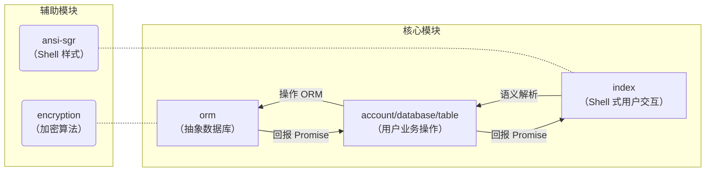

# 欢迎使用 PenyoDB

PenyoDB 是一款基于 TypeScript 的 NoSQL 数据库，兼容部分 SQL 语法。

## 模块设计

```mermaid
flowchart RL
    subgraph 核心模块
        index["index\n（Shell 式用户交互）"] -- 语义解析 --> uop["account/database/table\n（用户业务操作）"] -- 操作 ORM --> orm["orm\n（抽象数据库）"]
        orm -- 回报 Promise --> uop -- 回报 Promise --> index
    end
    subgraph 辅助模块
        index -.- ansi-sgr("ansi-sgr\n（Shell 样式）")
        orm -.- encryption("encryption\n（加密算法）")
    end
```
